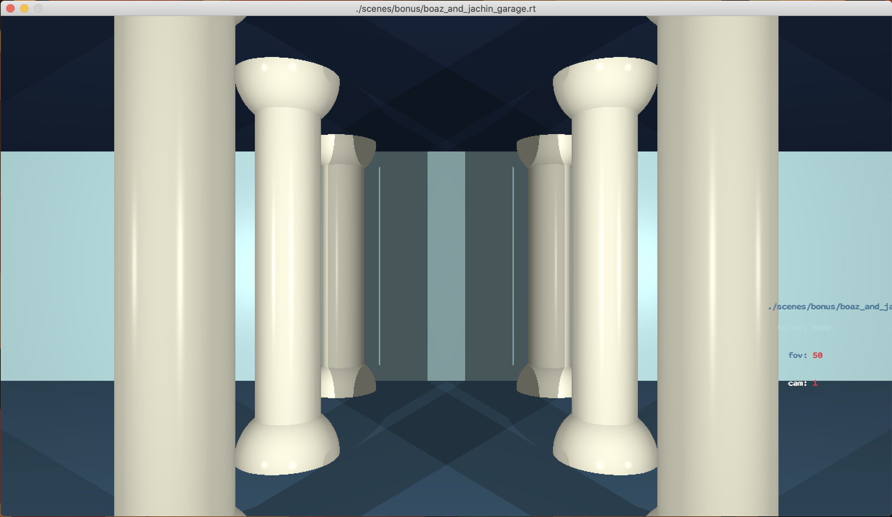
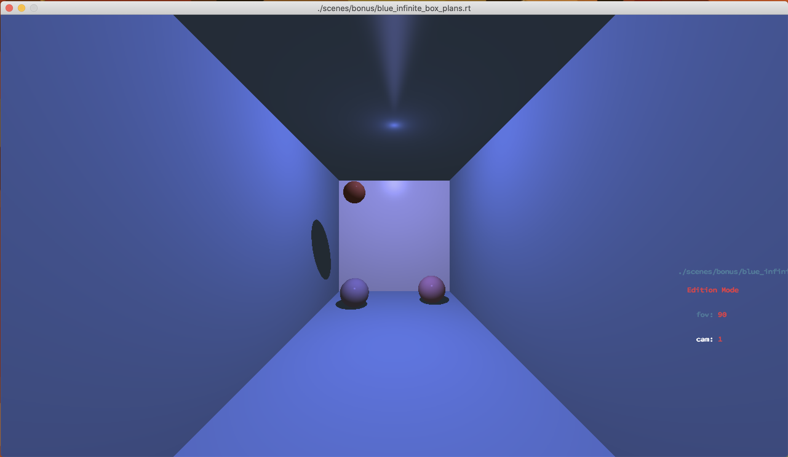
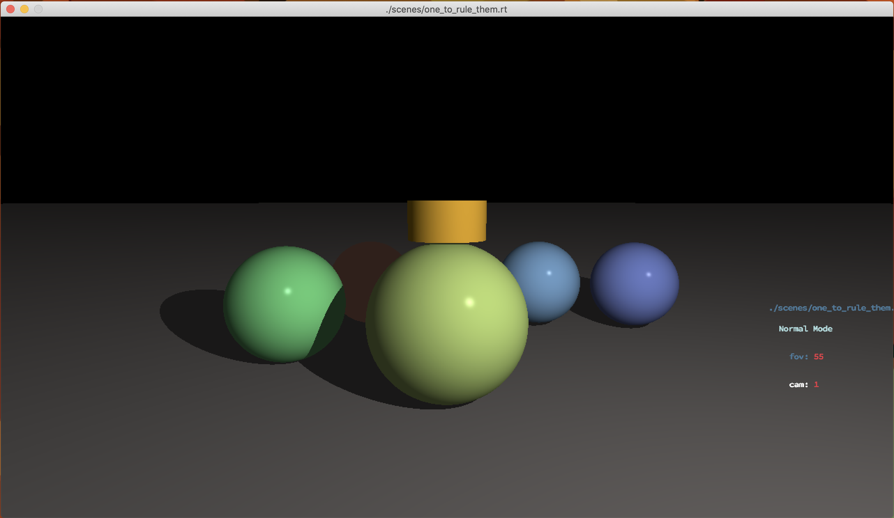
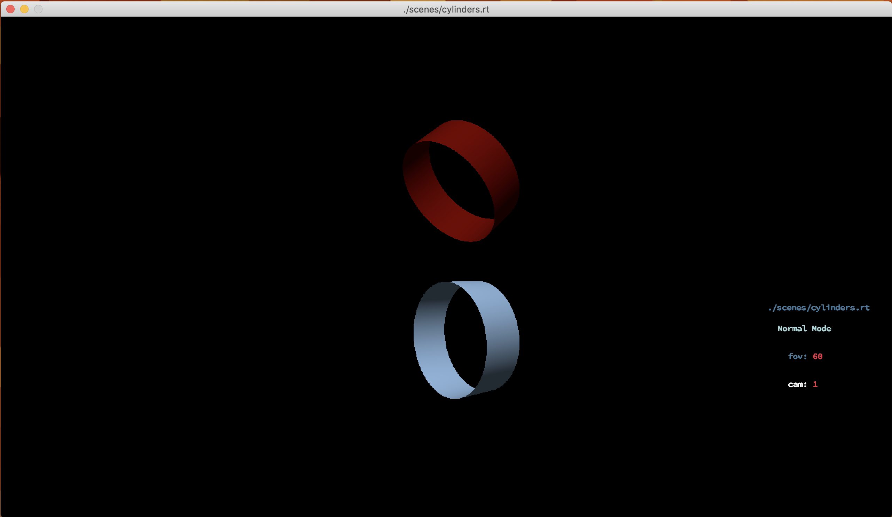

<h1 align="center">
    MiniRT
</h1>
<h4 align="center">
    A simple raytracer written in C
</h4>
<p align="center">
    <a href="README.md">Normal</a>
    ·       
    <a href="README.fr.md">Bonus</a>
</p>



## Table of Contents

- [About the Project](#about-the-project)
- [Getting Started](#getting-started)
    - [Prerequisites](#prerequisites)
    - [Installation](#installation)
    - [Usage](#usage)
- [Bonus](#bonus)
- [Contributing](#contributing)

## About The Project

This project is a simple raytracer written in C. It is a part of the 42 school curriculum. The goal of this project is to learn about raytracing and to create a simple raytracer.

## Getting Started

To get a local copy up and running follow these simple steps.

### Prerequisites

- [GCC](https://gcc.gnu.org/)
- [Make](https://www.gnu.org/software/make/)
- [MinilibX](https://harm-smits.github.io/42docs/libs/minilibx/getting_started.html)
- [Libft](https://github.com/josiaskas/libft)

### Installation

1. Clone the repo, with submodules (libft)
```sh
    git clone --recurse-submodules
```

- The submodules are needed to compile the project, if you forgot to clone with submodules, you can use the following command:
    ```sh
        git submodule update --init --recursive
    ```
    Also miniLibX is needed to compile the project, there is a builded version of the library in the repository, but if you want to build it yourself, you can use the following command:
    ```sh
        make -C minilibx
    ```

2. Compile the project
```sh
    make
```
Note: If you want to compile the project with the bonus, you can use the following command:
```sh
    make bonus
```

### Usage

1. Run the program
```sh
    ./miniRT [scene_file]
```

## Bonus

- [x] Multithreading
- [x] Normal mapping
- [x] Camera switching
- [x] Save the rendered image in a .bmp file
- [x] Multiple light sources
- [x] Multiple objects, with different materials

## Images




